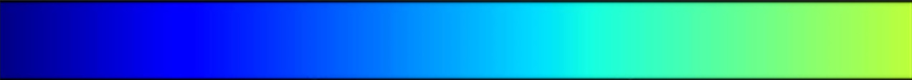
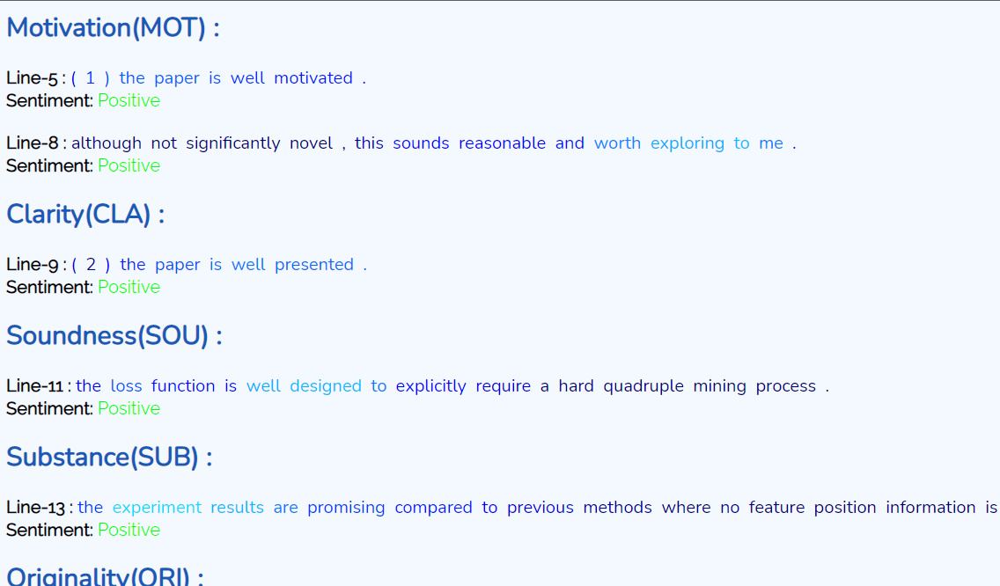
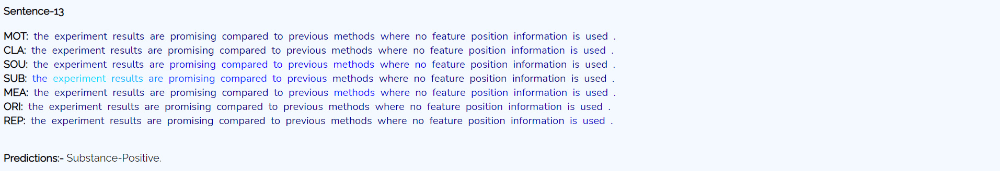

# Examples

Have a look at some of the best attention maps that that the model has generated. 
To visualize the distribution of attention weights across the reviews/sentences, download the respective files using the download button (top right), and open the html files using your web browser. 

The colormap used is scaled verion of 'matplotlib.cmap.jet'. To know more about the colormaps, visit the [page](https://matplotlib.org/stable/tutorials/colors/colormaps.html) 
- Custom colormap in use:

Let's say you've picked the 'NIPS_2016_142' example. The NIPS_2016_142.html file shows a aspect-wise structured analysis of the review. 
For visualizing a sentence-wise aspect-wise attention distribution, open the directory named 'NIPS_2016_142'. This directory will have an individual file for each sentence, showing the attention distribution for that particular sentence respectively. 
The files must display something similar to what's shown below - 

- Aspect-wise Heatmap:

- Attention distribution over a single sentence instance:

